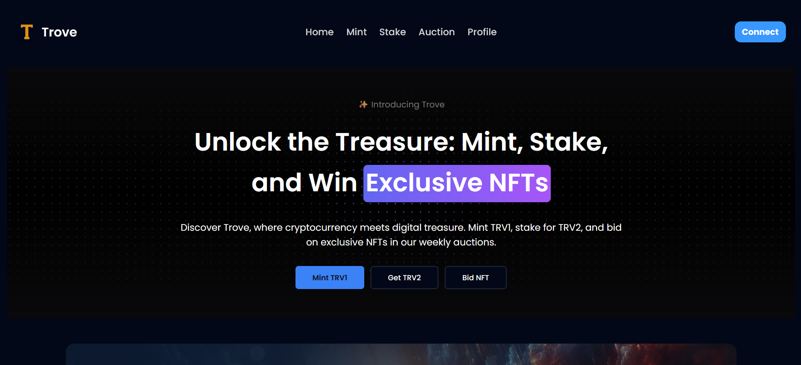

<p align="center">
  <br />
  <a href="">
      
  </a>
</p>

<p align="center">
This is a web3 project that is built on the <a href="https://www.base.org/">Base Blockchain</a>, which is a <a href="https://ethereum.org/en/layer-2/">layer 2</a> chain for Ethereum blockchain using <a href="https://ethereum.org/en/developers/docs/scaling/optimistic-rollups/">optimistic rollups</a>. The project is deployed on <a href="https://sepolia.basescan.org">Base Sepolia testnet</a> blockchain to allow easy access to the smart contract without cost, the <a href="https://trove-web3.netlify.app/">website</a> provides an interface to interact with the smart contract easily.
</p>

<p align="center">
  
  
  
  
  
  
  
  <br />
      
  <br />
  <br />
  
  <br />
</p>

## Tools/package/framework used

- [Remix](https://remix.run) - A fully featured ReactJs framework
- [Wagmi](https://wagmi.sh/) - A type safe React hook library for Ethereum, allow easy integration with Foundry
- [Foundry](https://book.getfoundry.sh/) - A smart contract development toolchain ([Hardhat](https://hardhat.org/) alternative)
- [RainbowKit](https://www.rainbowkit.com/) - A wallet interface for user to connect their wallet, seamless integration with Wagmi
- [shadcn/ui](https://ui.shadcn.com/) - Pre-build React component on top of [Radix-ui](https://www.radix-ui.com/) and [tailwindcss](https://tailwindcss.com/)
- [Eslint](https://eslint.org/) and [Prettier](https://prettier.io/) - Eslint for linting code and Prettier to format the styling of code.
- [Typescript](https://www.typescriptlang.org/) and [Solidity](https://soliditylang.org/) - Full type safety on both frontend and blockchain development
- [Windows WSL](https://learn.microsoft.com/en-us/windows/wsl/) - To run the project on a Windows machine, this is a requirement
- Makefile - I use it to run rpc command easily without typing out the long rpc curl command

## Development

### Prerequisites

The following is a requirement if you wish to run the project locally on your machine

1. If you are using Windows operating system, then [Windows WSL](https://learn.microsoft.com/en-us/windows/wsl/) is needed. This is because forge does not seems to be able to work well on Windows environment. The project should be cloned into the WSL drive instead of the windows drive and access it from wsl terminal. You should be fine if you are using either Mac os or Linux based operating system.
2. Have foundry toolchain installed, refer to the [documentation](https://book.getfoundry.sh/) on the installation of the programs.

   - You should have the following commands available after your foundry installation

     ```bash
     forge --version
     anvil --version
     chisel --version
     cast --version
     ```

3. You need to have [pnpm](https://pnpm.io/installation) package manager installed as the project's dependency is managed using pnpm.
4. Have Make installed, so you can run execute some commands faster and easier to test your application with the local anvil blockchain.

### Local development

1. Clone the repository to your local machine:

   ```bash
   git clone https://github.com/AlstonChan/Web3BaseTrove
   ```

2. Install the required dependencies for Remix app:

   ```bash
   pnpm install
   ```

3. Open up a new terminal, and change directory (`cd`) into the project's `contracts` directory to

   1. Run the local blockchain node (anvil)
   2. Deploy the contract to local blockchain

   Execute the `start_anvil.sh` file and it will does the job.

   ```bash
   ./start_anvil.sh
   ```

> \[!WARNING]\
> The private key in the start_anvil.sh file is using the private key provided by anvil package. You **SHOULD NOT** expose your private key in the terminal as such when using your own private key or you are in risk of getting your private key leak!

4. Run the Remix development server at the root of the project:

   ```bash
   pnpm dev
   ```

You should have at least two terminal opened that are running a process.

- Remix dev server
- Anvil blockchain testnet

> \[!NOTE]\
> Whenever you have made changes to `wagmi.config.ts` file or have updated the smart contract interface (like adding a new function/change the args/update the function return type), you **SHOULD** run `pnpm wagmi` to regenerate the `app/generated.ts` file.

### Improvement to made

This project has been marked as completed, but further improvement can be made.

- [ ] Add a new tab at profile page to allow user to view the auctions that they have bid on
  - [ ] Allow user to see if they can claim bid or rewards without clicking in
- [ ] Add social images/metadata
- [ ] Add security headers
- [ ] Auto refresh the relevant data of the operation once transaction has been included in the block
- [ ] Configure Bridge
  - [ ] Bridge from Base to Ethereum
  - [ ] Bridge from Base to other superchain (Optimism, Redstone, etc..)

## Deployment

The [frontend website](https://trove-web3.netlify.app/) is deployed to Netlify (with Netlify Functions) using the `@netlify/remix-adapter` package adapter for RemixJs.

The smart contract of the project has been deployed to the Base Sepolia testnet. All 5 contracts can be found on [BaseScan](https://sepolia.basescan.org) that is already verified on deployed.

- Trove - [0xbeA56E6FE2a1dd5730f26911393423fF9769d9Aa](https://sepolia.basescan.org/address/0xbeA56E6FE2a1dd5730f26911393423fF9769d9Aa#code)
- Trove1 - [0xA918a1656f58448D1E2419c523B11Df10b05099a](https://sepolia.basescan.org/address/0xA918a1656f58448D1E2419c523B11Df10b05099a#code)
- Trove2 - [0x5D258E6cc4078fd2EAC464E07B26DFC40439A594](https://sepolia.basescan.org/address/0x5D258E6cc4078fd2EAC464E07B26DFC40439A594#code)
- TroveStake - [0xd9b4CcF687a3b9f5079756349154D8583D379B98](https://sepolia.basescan.org/address/0xd9b4CcF687a3b9f5079756349154D8583D379B98#code)
- TroveAuction - [0x1788EE841E724E500eD0fB3446E3076b7182DCCF](https://sepolia.basescan.org/address/0x1788ee841e724e500ed0fb3446e3076b7182dccf#code)

## License

This project is licensed under [GNU General Public License v3](./LICENSE.txt)
